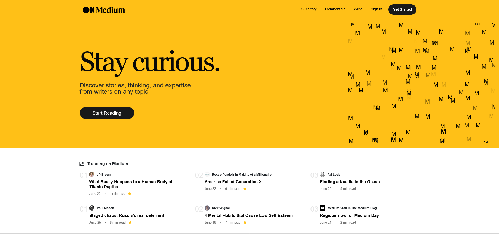

# Medium Anasayfa Clone Uygulaması

Bu proje, web geliştirme yeteneklerimi sergilemek ve Medium platformunun tasarımını taklit etmeyi amaçlamaktadır. Temel olarak kullanıcıya makale başlıklarını ve yazarlarını gösterir.
Proje linki: [Medium Clone](https://medium-clone-bootstrap-one.vercel.app/)

## 🚀 Özellikler

- Medium anasayfasının birebir kopyasıdır.
- Makale başlıkları ve yazarlarını dinamik olarak gösterir.
- Basit ve kullanıcı dostu arayüze sahiptir.

## 💻 Projenin Kurulumu

- 1-Bu projeyi bilgisayarınıza klonlayın:
  `git clone https://github.com/kullaniciadi/medium-clone.git`
- 2-Proje dizinine gidin:
  `cd medium-clone
`
- 3-index.html dosyasını bir tarayıcıda açarak uygulamayı çalıştırın.

<h2> 🛠️ &nbsp;Kullanılan Teknolojiler</h2>

Bu proje, **HTML**, **CSS** ve **Bootstrap** kullanılarak oluşturulmuştur. Front-end geliştirme becerilerimi sergileyerek işlevsel ve kullanıcı dostu bir web uygulaması oluşturma yeteneğimi göstermektedir.

<table style="margin: 0 auto;">
  <tr>
    <td></td>
    <td></td>
    <td></td>
  </tr>
</table>

## 🤝 Katkıda Bulunma

Bu proje herhangi bir katkıda bulunmaya açıktır. Katkıda bulunmak için aşağıdaki adımları izleyebilirsiniz:

1-Bu depoyu "fork" edin.
2-Yeni bir dal oluşturun: git checkout -b yeni-ozellik
3-Değişikliklerinizi yapın ve bunları gönderin: git commit -am 'Yeni özellik eklendi'
4-Branch'i ana repoa gönderin: git push origin yeni-ozellik
5-Bir Pull Request (PR) açın.

☎️ Bu projeyle ilgili herhangi bir sorunuz veya geri bildiriminiz varsa, lütfen iletişime geçmekten çekinmeyin. İyi kullanımlar!
