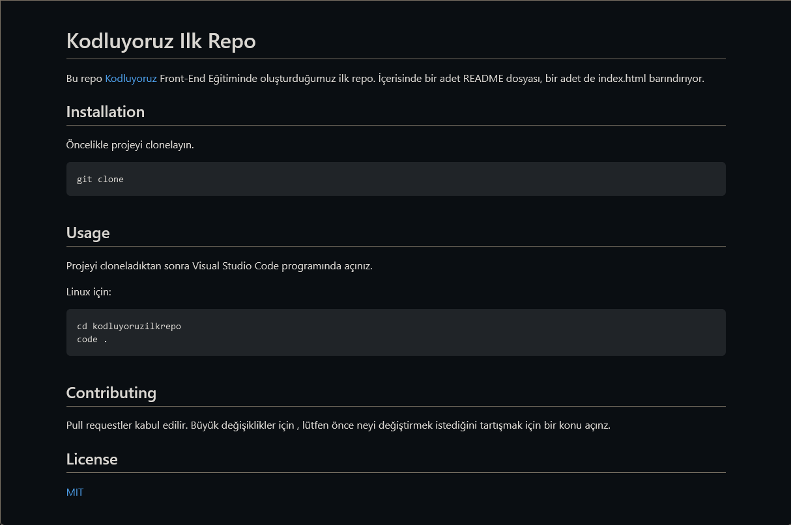

# Kodluyoruz Ilk Repo

Bu repo [Kodluyoruz](https://kodluyoruz.org) Front-End Eğitiminde oluşturduğumuz ilk repo. İçerisinde bir adet README dosyası, bir adet de index.html barındırıyor.



## Installation

Öncelikle projeyi clonelayın.

```
git clone
```

## Usage

Projeyi cloneladıktan sonra Visual Studio Code programında açınız.

Linux için:

```
cd kodluyoruzilkrepo
code .
```

## Contributing

Pull requestler kabul edilir. Büyük değişiklikler için , lütfen önce neyi değiştirmek istediğini tartışmak için bir konu açınz.

## License

[MIT](https://choosealicense.com/)

[Patika Profilim](https://app.patika.dev/onefourthreebb)
